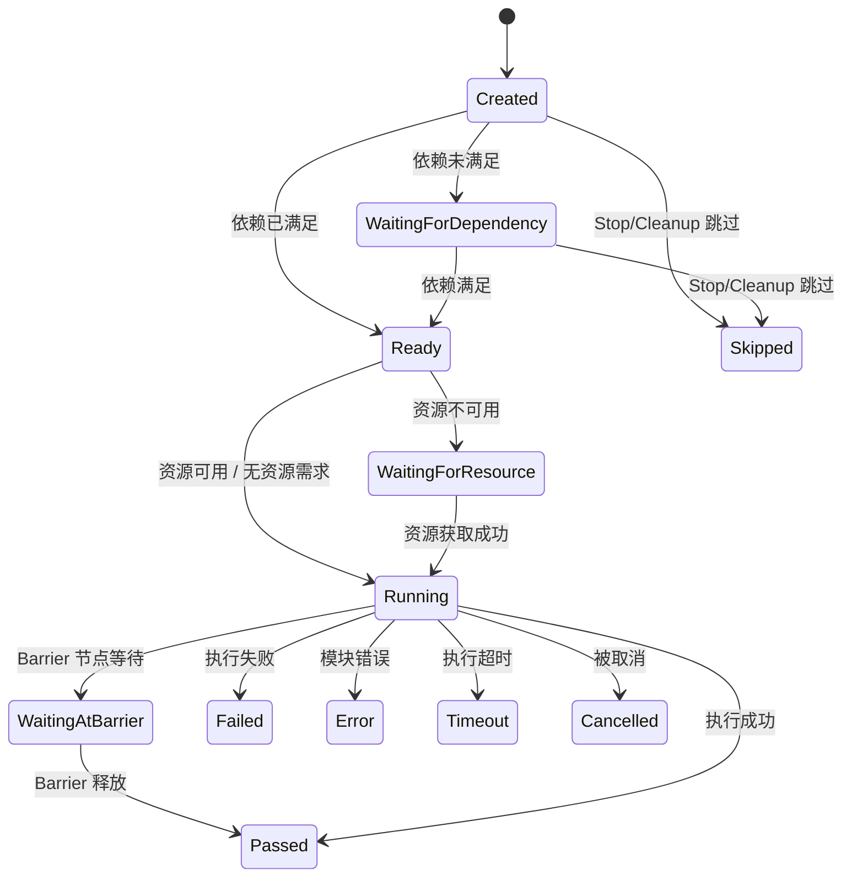
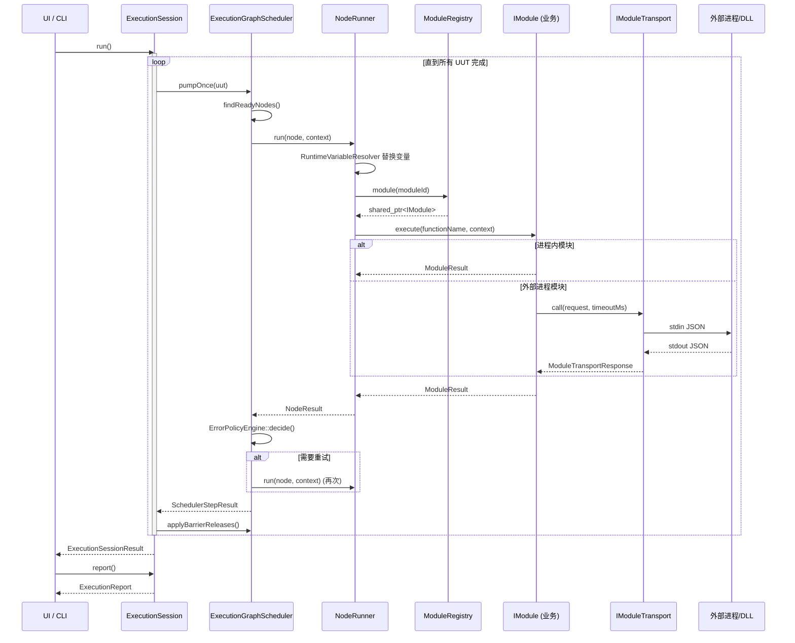
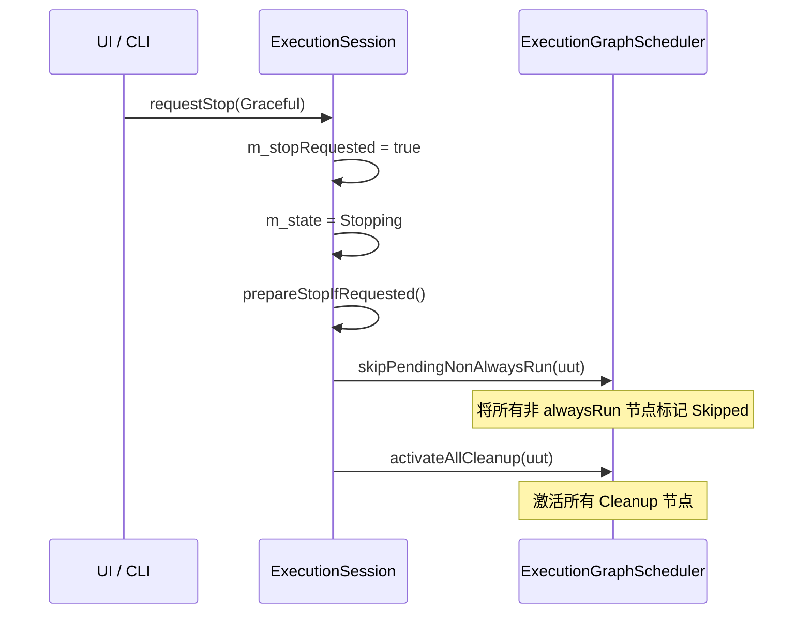
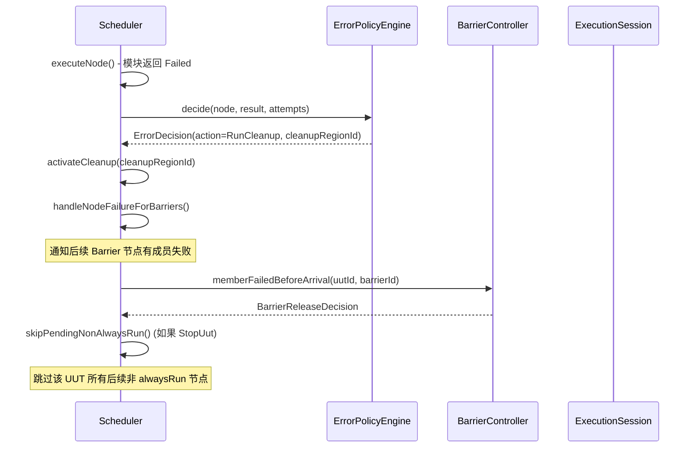
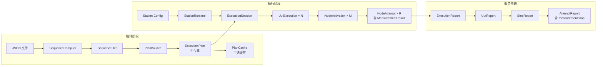
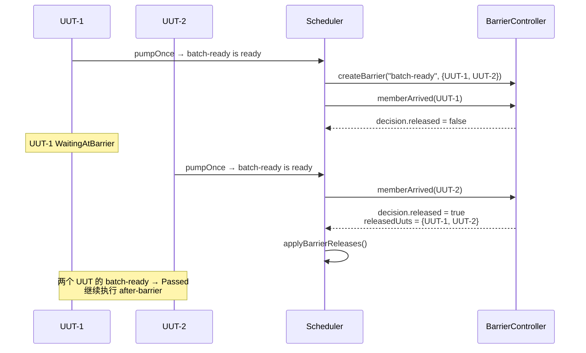
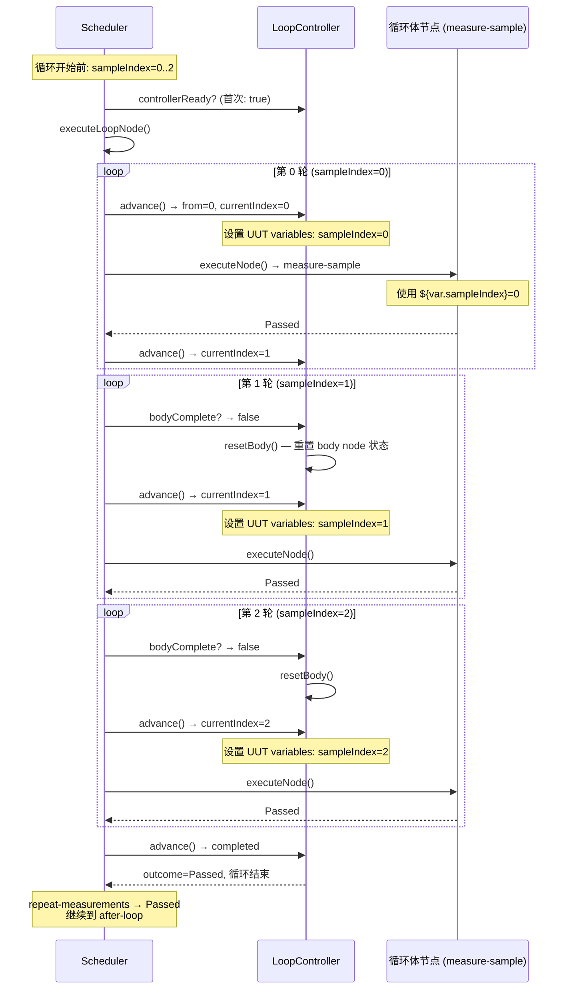
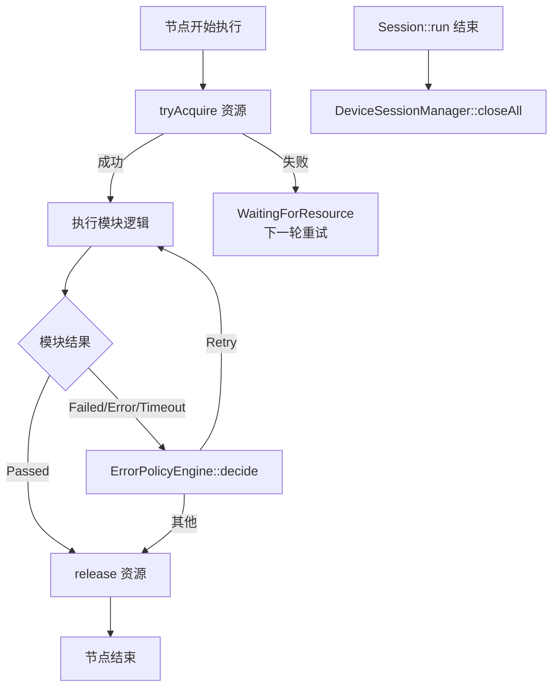

# PicoATE 任务引擎架构设计文档

|版本|日期|作者|
|----|----|----|
|1.0|2026-06-26|架构评审|

---

## 目录

1. [系统定位](#一系统定位)
2. [项目目录结构分析](#二项目目录结构分析)
3. [核心架构设计](#三核心架构设计)
4. [任务生命周期分析](#四任务生命周期分析)
5. [三层解耦架构分析](#五三层解耦架构分析)
6. [任务引擎提供给 UI 的接口](#六任务引擎提供给-ui-的接口)
7. [任务引擎提供给业务层的接口](#七任务引擎提供给业务层的接口)
8. [三层交互方式分析](#八三层交互方式分析)
9. [核心流程分析](#九核心流程分析)
10. [设计模式分析](#十设计模式分析)
11. [扩展机制分析](#十一扩展机制分析)
12. [异常处理设计](#十二异常处理设计)
13. [性能与并发分析](#十三性能与并发分析)
14. [日志与可观测性](#十四日志与可观测性)
15. [接口边界合理性评估](#十五接口边界合理性评估)
16. [优化建议](#十六优化建议)
17. [附录](#十七附录)

---

## 一、系统定位

### 1.1 引擎身份

ATE（Automated Test Equipment）是一个**生产测试系统的任务调度与执行引擎**，是整个 ATE 软件栈中的核心中间层。它负责将声明式 JSON 测试序列编译为可执行计划，管理多 UUT 并发调度、资源仲裁、批次同步、错误恢复和设备连接生命周期，同时保持与上层 UI 和下层业务模块的解耦。

源码依据：[README.md:3-4](src/../README.md)：

> PicoATE is the first implementation slice of the ATE runtime described in `architecture_v3_1.md`.

### 1.2 在整体系统中的位置

```
┌──────────────────────────────────────────────────┐
│                  MES / 工厂系统                    │
│                   （未来接入）                      │
├──────────────────────────────────────────────────┤
│              UI 层（Qt Widgets，规划中）             │
│         消费 ExecutionReport 只读 DTO              │
├──────────────────────────────────────────────────┤
│              ★ PicoATE 任务引擎（本工程）★           │
│  ┌──────────┐ ┌──────────┐ ┌──────────────────┐  │
│  │ JSON编译器│ │ 调度引擎  │ │ 设备连接管理器    │  │
│  │ +Plan    │ │ Scheduler│ │ DeviceSession    │  │
│  │ Builder  │ │          │ │ Manager          │  │
│  └──────────┘ └──────────┘ └──────────────────┘  │
│  ┌──────────────────────────────────────────────┐ │
│  │         ModuleRegistry / NodeRunner          │ │
│  └──────────────────────────────────────────────┘ │
├──────────────────────────────────────────────────┤
│              Transport 抽象层                      │
│  QProcess │ Persistent │ DllBridge │ NativeHost   │
├──────────────────────────────────────────────────┤
│          业务模块（DLL / Python / EXE）             │
├──────────────────────────────────────────────────┤
│        设备层（DMM / CAN / PSU / Fixture）          │
└──────────────────────────────────────────────────┘
```

### 1.3 解决的问题

| 问题域 | 引擎承担的职责 | 关键源码 |
|--------|---------------|----------|
| 流程编排 | JSON 描述 Setup → Main → Cleanup 序列 | [SequenceCompiler.h:30](src/core/include/PicoATE/Core/SequenceCompiler.h) |
| 资源仲裁 | 多 UUT 对 DMM1/CAN1 的互斥申请与排队 | [ResourceManager.h:62](src/core/include/PicoATE/Core/ResourceManager.h) |
| 批次同步 | 多 UUT 到 Barrier 点后等待、到齐释放 | [BarrierController.h:102](src/core/include/PicoATE/Core/BarrierController.h) |
| 错误恢复 | 失败→重试、失败→清理、失败→跳过 | [ErrorPolicyEngine.h:16](src/core/include/PicoATE/Core/ErrorPolicyEngine.h) |
| 循环控制 | For 循环由调度层控制，Plan 保持不可变 | [LoopController.h:14](src/core/include/PicoATE/Core/LoopController.h) |
| 设备连接 | 逻辑设备 ID ↔ 真实地址映射、连接复用 | [DeviceSessionManager.h:77](src/core/include/PicoATE/Core/DeviceSessionManager.h) |
| 模块隔离 | DLL/Python 崩溃不影响引擎进程 | [nativehost/Main.cpp](src/nativehost/Main.cpp) |

### 1.4 输入 / 输出

**输入：**

| 输入 | 格式 | 提供方 |
|------|------|--------|
| Sequence JSON | JSON 文件，描述测试步骤、策略、输入 | 测试工程师/项目团队 |
| Station Config JSON | JSON 文件，描述工站设备地址、driver | 工站配置 |
| UUT 数量 | CLI 参数 `--uuts N` | 操作员/上位机 |
| 业务模块 | DLL（C ABI）、Python 脚本、独立 EXE | 项目团队 |

**输出：**

| 输出 | 格式 | 消费者 |
|------|------|--------|
| ExecutionReport | 结构化 DTO（UUT/Step/Attempt/Measurement） | UI / CLI / MES |
| ExecutionSessionResult | 含 completed、hasError、nodeResults | CLI / 调用方 |
| SessionSnapshot | 可序列化的资源/Barrier/UUT 状态 | 未来持久化/恢复 |
| CLI 文本输出 | stdout 打印 step/attempt/measurement | 调试/日志 |

### 1.5 上下游依赖

| 外部系统 | 当前状态 | 交互方式 |
|----------|----------|----------|
| UI 层 | 无，已规划 | 通过 ExecutionReport DTO（只读）消费 |
| 设备层 (DMM/CAN/PSU) | Fake 已验证，真实硬件未接 | 通过 IModuleTransport → PersistentQProcessTransport |
| MES | 无 | 当前代码无法确认 |
| 数据库 | 无 | 仅 ISessionPersistence 接口占位 |
| Python 脚本 | 已验证 | QProcessTransport + moduleBindings |
| C/C++ DLL | 已验证 | PicoATE.NativeHost.exe + PicoATE_Execute C ABI |

### 1.6 核心设计约束

来自 [project_vision.md](docs/project_vision.md)：

| 约束 | 含义 |
|------|------|
| 协议逻辑不进调度器 | CAN/LIN/DMM 命令解析属于模块或 Transport Host |
| UI 只消费只读 DTO | 使用 ExecutionReport，不读 NodeActivation 内部状态 |
| 调度器拥有编排权 | Retry/Cleanup/Loop/Barrier/Resource 集中管理 |
| 模块返回中性结果 | 返回 ModuleResult，不返回 NodeResult 或 UI 数据 |
| 配置声明式 | 流程/策略/资源/输入用 JSON 描述，不编译进代码 |
| Transport 可替换 | DLL/Python/QProcess/gRPC 都放 IModuleTransport 后面 |

---

## 二、项目目录结构分析

### 2.1 顶层目录

```
PicoATE/
├── CMakeLists.txt           # C++20, Qt6 Core+Test, 示例目录
├── CMakePresets.json        # VS2022 + Qt6.9.1 x64 预设
├── README.md                # 构建/运行说明
├── test_output.txt          # 最近测试输出记录
├── docs/                    # 15 份设计/规范/总结文档
├── examples/                # 16 个示例（JSON序列、模块、工站配置）
├── src/                     # 全部源代码
│   ├── core/                # ★ 核心引擎库（静态库）
│   ├── cli/                 # 命令行入口
│   ├── mockhost/            # 测试用外部 echo 进程
│   ├── nativehost/          # DLL 隔离加载器进程
│   ├── fakeinstrumenthost/  # 假仪器长驻进程
│   ├── testdllmodule/       # C ABI 测试 DLL
│   └── canexamplemodule/    # 模拟 CAN 解码 DLL
├── tests/                   # 单元测试
│   ├── CMakeLists.txt
│   └── CoreTests.cpp        # 3408 行，34 个测试用例
└── out/                     # 构建输出（VS2022 生成）
```

### 2.2 各模块职责与核心类

#### src/core/ — 核心引擎库（PicoATECore，静态库）

这是整个引擎的核心，包含 27 个头文件 + 27 个实现文件，按功能分组：

**A. 数据模型层**

| 头文件 | 核心类型 | 职责 |
|--------|----------|------|
| ExecutionPlan.h | `ExecNode`, `ExecEdge`, `ExecutionPlan`, `CleanupRegion`, `LoopRegion`, `ForLoopSpec` | 不可变执行计划，含节点/边/清理区/循环区 |
| RuntimeTypes.h | `UutExecution`, `NodeActivation`, `NodeAttempt`, `ExecutionFrame`, `ExecutionState` | 运行时可变状态，含多 UUT 视图 |
| SequenceDef.h | `SequenceDef`, `StepDef`, `StepGroupDef`, `ModuleBindingDef` | 编辑期模型，JSON 反序列化产物 |
| MeasurementTypes.h | `MeasurementResult`, `MeasurementStatus` | 结构化测量值 DTO |
| ExecutionReport.h | `ExecutionReport`, `UutReport`, `StepReport`, `AttemptReport`, `StepLoopReport` | 只读运行报告 DTO |
| SessionSnapshot.h | `ExecutionSessionSnapshot`, `ISessionPersistence` | 会话快照与持久化接口占位 |

**B. 编译与构建层**

| 头文件 | 核心类型 | 职责 |
|--------|----------|------|
| SequenceCompiler.h | `SequenceCompiler`, `CompileResult`, `CompileError`, `CompileWarning` | JSON → SequenceDef → ExecutionPlan，含类型校验和未知字段警告 |
| PlanBuilder.h | `PlanBuilder`, `PlanBuildResult`, `PlanBuildError` | SequenceDef → ExecutionPlan 图构建 |
| PlanCache.h | `PlanCache` | 基于 shared_ptr 的编译缓存 |

**C. 调度引擎层**

| 头文件 | 核心类型 | 职责 |
|--------|----------|------|
| ExecutionSession.h | `ExecutionSession`, `ExecutionSessionResult` | 多 UUT 执行会话主入口 |
| ExecutionGraphScheduler.h | `ExecutionGraphScheduler`, `SchedulerResult`, `SchedulerStepResult` | 节点调度：依赖检查→资源获取→执行→错误处理 |
| NodeRunner.h | `NodeRunner`, `INodeHandler`, `NoopNodeHandler`, `WaitNodeHandler`, `ActionNodeHandler` | 节点分发执行器，Handler 模式 |
| ResourceManager.h | `ResourceManager`, `ResourceLease`, `ResourceRequest` | 资源互斥申请、排队、释放 |
| BarrierController.h | `BarrierController`, `BarrierRuntimeState`, `BarrierReleaseDecision` | 多 UUT 批次同步（6 种到达策略 × 4 种释放策略 × 5 种失败策略） |
| LoopController.h | `LoopController`, `LoopControllerResult` | For 循环游标控制 |
| ErrorPolicyEngine.h | `ErrorPolicyEngine`, `ErrorDecision` | 错误策略决策（Continue/StopUut/Retry/RunCleanup/Abort） |

**D. 模块运行时层**

| 头文件 | 核心类型 | 职责 |
|--------|----------|------|
| ModuleRuntime.h | `IModule`, `IModuleTransport`, `ModuleRegistry`, `TransportModuleAdapter`, `ModuleExecutionContext`, `ModuleResult`, `IModuleRuntimeServices` | 模块执行、传输抽象、设备服务注入 |
| NodeRunner.h | 同上含 `ActionNodeHandler` | 将模块调用嵌入节点执行 |
| ModuleTransportJson.h | JSON 序列化/反序列化函数 | Transport 请求/响应 ↔ JSON |
| ModuleBindingRegistrar.h | `registerConfiguredModules()` | JSON moduleBindings → 运行时模块注册 |

**E. Transport 实现层**

| 头文件 | 核心类型 | 职责 |
|--------|----------|------|
| QProcessTransport.h | `QProcessTransport` | 短生命周期子进程 transport |
| PersistentQProcessTransport.h | `PersistentQProcessTransport` | 长驻子进程 transport，跨调用保持状态 |
| DllBridgeInvoker.h | `DllBridgeInvoker` | 进程内 QLibrary DLL 调用（原型验证用） |
| NativeHostManifest.h | `NativeHostManifest`, `loadNativeHostManifest()` | DLL 加载清单 JSON 解析 |

**F. 设备管理层**

| 头文件 | 核心类型 | 职责 |
|--------|----------|------|
| DeviceSessionManager.h | `DeviceSessionManager`, `IDeviceSession`, `IDeviceSessionFactory`, `DeviceSessionConfig`, `DeviceSessionLifetime` | 逻辑设备注册、连接复用、状态管理 |
| DeviceTransportSession.h | `TransportDeviceSession`, `TransportDeviceSessionFactory` | 将 Transport 映射为设备 session |
| StationConfig.h | `StationConfig`, `parseStationConfigJson()`, `configureDeviceSessions()` | 工站配置 JSON 解析 |
| StationRuntime.h | `StationRuntime` | 工站运行上下文，持有 StationConfig + DeviceSessionManager |
| InstrumentAdapterModules.h | `ExampleDmmAdapterModule`, `ExampleCanAdapterModule` | DMM/CAN 适配器 Spike 实现 |

**G. 变量替换层**

| 头文件 | 核心类型 | 职责 |
|--------|----------|------|
| VariableResolver.h | `VariableResolver`, `VariableResolverOptions` | 配置期 ${PROJECT_DIR} 等替换，支持递归和容器 |
| RuntimeVariableResolver.h | `RuntimeVariableResolver`, `RuntimeVariableContext` | 运行期 ${var.NAME}/${loop.index}/${uut.id} 替换 |

#### src/cli/ — 命令行入口

[Main.cpp](src/cli/Main.cpp)：唯一入口文件（517 行）。组装整个 pipeline：编译 JSON → 加载 Station Config → 创建 ExecutionSession → 注册模块 → 运行 → 打印报告。

#### src/mockhost/ — 测试用 Echo 进程

[Main.cpp](src/mockhost/Main.cpp)（72 行）：stdin 读一行 JSON → echo 回去。验证 QProcessTransport 协议。

#### src/nativehost/ — DLL 隔离加载器

[Main.cpp](src/nativehost/Main.cpp)（207 行）：stdin 读请求 → QLibrary 加载 DLL → 调用 PicoATE_Execute → stdout 写响应。支持 --manifest 和 --dll 两种模式。

#### src/fakeinstrumenthost/ — 假仪器长驻进程

[Main.cpp](src/fakeinstrumenthost/Main.cpp)（320 行）：保持进程运行，累积设备状态（openCount/readCount），支持 open/read/configureDcv/close/health/reconnect/shutdown 命令。验证 PersistentQProcessTransport 跨 step 状态保持。

#### src/testdllmodule/ — C ABI 测试 DLL

[TestDllModule.cpp](src/testdllmodule/TestDllModule.cpp)（80 行）：实现 `PicoATE_Execute` C ABI。支持 dllSleepMs（超时测试）、dllReturnCode（错误测试）、outputs/measurements 回传。

#### src/canexamplemodule/ — 模拟 CAN 解码 DLL

[CanExampleModule.cpp](src/canexamplemodule/CanExampleModule.cpp)（247 行）：解析 rawBytes（hex string/array）→ 按 signal 定义解码（大小端/有无符号/scale/offset）→ 限值判定 → 返回 MeasurementResult。纯软件验证，不需要 CAN 分析仪。

### 2.3 模块依赖关系

```
                     PicoATECli
                         │
        ┌────────────────┼────────────────┐
        ▼                ▼                ▼
   PicoATECore    PicoATEMockHost   PicoATENativeHost
    (静态库)       (独立进程)         (独立进程)
        │
        ├── Qt6::Core
        ├── Qt6::Test（仅测试）
        │
        └── 以下为 Core 内部层次：
        
  ┌────────────────────────────────────────────┐
  │  StationRuntime → StationConfig             │  ← 工站配置
  │       │                                     │
  │       ▼                                     │
  │  DeviceSessionManager ← TransportDeviceSession │ ← 设备管理
  │       │                                     │
  │       ▼                                     │
  │  IModuleRuntimeServices                     │
  └────────────────────────────────────────────┘
                      │
  ┌────────────────────────────────────────────┐
  │  SequenceCompiler → PlanBuilder             │  ← 编译层
  │       │                                     │
  │       ▼                                     │
  │  ExecutionPlan（不可变）                      │
  └────────────────────────────────────────────┘
                      │
  ┌────────────────────────────────────────────┐
  │  ExecutionSession                           │  ← 会话层
  │       │                                     │
  │       ├── ExecutionGraphScheduler           │  ← 调度层
  │       │       │                             │
  │       │       ├── ResourceManager           │
  │       │       ├── BarrierController         │
  │       │       ├── LoopController            │
  │       │       ├── ErrorPolicyEngine         │
  │       │       └── NodeRunner                │
  │       │               │                     │
  │       │               ├── NoopNodeHandler   │
  │       │               ├── WaitNodeHandler   │
  │       │               └── ActionNodeHandler │
  │       │                       │             │
  │       │                       ▼             │
  │       │               ModuleRegistry        │  ← 模块层
  │       │                       │             │
  │       │                       ▼             │
  │       │               IModuleTransport      │  ← Transport 层
  │       │               ├── QProcessTransport │
  │       │               ├── PersistentQProcess│
  │       │               └── DllBridgeInvoker  │
  │       │                                     │
  │       ├── ModuleBindingRegistrar            │
  │       ├── VariableResolver                 │
  │       └── RuntimeVariableResolver          │
  └────────────────────────────────────────────┘
```

**依赖方向（自底向上）：**

```
Transport 实现 → IModuleTransport（抽象）
                 → IModule（抽象）
                   → NodeRunner → Scheduler → Session
                                             → StationRuntime
                                               → CLI
```

**关键规则：** 上层依赖抽象接口（IModule, IModuleTransport, IDeviceSession），不依赖具体 Transport 或设备实现。所有具体实现通过 ModuleRegistry / DeviceSessionManager 的注册机制注入。

---

## 三、核心架构设计

### 3.1 架构风格识别

PicoATE 采用了**分层 + 管道 + 策略 + 注册**的混合架构风格：

| 架构风格 | 体现在 | 代码证据 |
|----------|--------|----------|
| **分层架构** | 编译层 → 会话层 → 调度层 → 模块层 → Transport 层 | 依赖方向单向，上层不依赖下层具体实现 |
| **管道（Pipeline）** | JSON → SequenceDef → ExecutionPlan → ExecutionSession → ExecutionReport | [SequenceCompiler.h](src/core/include/PicoATE/Core/SequenceCompiler.h) → [PlanBuilder.h](src/core/include/PicoATE/Core/PlanBuilder.h) → [ExecutionSession.h](src/core/include/PicoATE/Core/ExecutionSession.h) |
| **策略模式** | Barrier 的 6 种到达策略、4 种释放策略、错误恢复的 5 种动作 | [BarrierController.h:10-40](src/core/include/PicoATE/Core/BarrierController.h)、[ExecutionPlan.h:87-93](src/core/include/PicoATE/Core/ExecutionPlan.h) |
| **注册/插件** | IModule 通过 ModuleRegistry 注册，IDeviceSessionFactory 通过 DeviceSessionManager 注册 | [ModuleRuntime.h:115](src/core/include/PicoATE/Core/ModuleRuntime.h)、[DeviceSessionManager.h:79](src/core/include/PicoATE/Core/DeviceSessionManager.h) |
| **状态机** | ExecutionState（9 个状态）、ActivationState（11 个状态）、FrameState、AttemptState | [RuntimeTypes.h:12-65](src/core/include/PicoATE/Core/RuntimeTypes.h) |

### 3.2 数据流

```
                     ┌──────────────┐
                     │  JSON 文件    │
                     └──────┬───────┘
                            ▼
                  SequenceCompiler.compileJson()
                            │
                    ┌───────▼───────┐
                    │  SequenceDef  │  ← 编辑期模型
                    └───────┬───────┘
                            ▼
                    PlanBuilder.build()
                            │
                    ┌───────▼───────┐
                    │ ExecutionPlan │  ← 不可变执行图
                    └───────┬───────┘
                            ▼
                    ExecutionSession
                            │
              ┌─────────────┼─────────────┐
              ▼             ▼             ▼
         UUT-1         UUT-2         UUT-N
              │             │             │
              ▼             ▼             ▼
    ExecutionGraphScheduler.pumpOnce()  ← 每步驱动
              │
              ▼
         NodeRunner.run()
              │
              ▼
         IModule.execute()
              │
              ▼
         ModuleResult → NodeResult → NodeActivation
              │
              ▼
         ExecutionReport  ← 只读 DTO
```

**关键设计决策：** ExecutionPlan 一旦构建完成就不可变。所有运行时状态（UutExecution, NodeActivation, NodeAttempt）存储在 ExecutionSession 中，不修改 Plan。这保证了：

- 同一个 Plan 可以被多个 UUT 共享
- PlanCache 可以安全地缓存和复用
- 未来的会话恢复只需要保存/恢复运行时状态

源码证据：[PlanCache.h:17](src/core/include/PicoATE/Core/PlanCache.h) 使用 `shared_ptr<const ExecutionPlan>`。

### 3.3 控制流

```
ExecutionSession::run()
  │
  └── 循环直到所有 UUT 完成：
        │
        └── 对每个 UUT：
              │
              └── ExecutionGraphScheduler::pumpOnce(uut)
                    │
                    ├── findReadyNodes()          // 拓扑找就绪节点
                    │     ├── 检查依赖是否满足
                    │     ├── 检查 Loop body 是否可运行
                    │     └── 跳过已终止节点
                    │
                    ├── executeNode()
                    │     ├── Loop 节点 → executeLoopNode()
                    │     │     └── LoopController::advance()
                    │     ├── Barrier 节点 → executeBarrierNode()
                    │     │     └── BarrierController::memberArrived()
                    │     └── Action/Cleanup 节点：
                    │           ├── ResourceManager::tryAcquire()  // 获取资源
                    │           ├── NodeRunner::run()  // 执行模块
                    │           │     └── RuntimeVariableResolver  // 变量替换
                    │           │         └── IModule::execute()
                    │           ├── ErrorPolicyEngine::decide()  // 错误决策
                    │           ├── activateCleanup()  // 触发清理
                    │           ├── skipPendingNonAlwaysRun()  // 跳过后继
                    │           └── handleNodeFailureForBarriers()
                    │
                    └── applyBarrierReleases()  // 释放等待中的 Barrier
```

核心调度循环在 [ExecutionSession.cpp:260-281](src/core/src/ExecutionSession.cpp)：

```cpp
bool progressed = true;
while (progressed) {
    prepareStopIfRequested();
    progressed = false;
    for (auto& uut : m_uuts) {
        auto step = m_scheduler->pumpOnce(uut);
        // ... 聚合结果
        m_scheduler->applyBarrierReleases(uutPointers());
    }
    if (allUutsComplete()) break;
}
```

### 3.4 生命周期管理

引擎内的生命周期分为四个层次：

| 层次 | 生命周期 | 管理组件 |
|------|----------|----------|
| **Session** | Idle → Running → Completed / CompletedWithError / Aborted | ExecutionSession |
| **Node/Activation** | Created → WaitingForDependency → WaitingForResource → WaitingAtBarrier → Ready → Running → Passed/Failed/Error/Timeout/Cancelled/Skipped | ExecutionGraphScheduler |
| **Attempt** | Created → Running → Completed / Cancelled | ExecutionGraphScheduler（重试循环内） |
| **Device Session** | Disconnected → Connecting → Connected → Error（跨 Step/Run/Station） | DeviceSessionManager |

### 3.5 调度模型

PicoATE 采用**同步协作式调度**：所有执行在主线程中通过循环泵送（pumpOnce）完成。每个 UUT 每轮尝试推进一个就绪节点。

关键特征：

- **单线程**：没有后台线程池执行测试步骤
- **协作式**：每个节点执行完后返回，不会长时间阻塞主循环
- **跨 UUT 轮转**：Round-robin 方式轮流推进各个 UUT

源码证据：整个调度循环在 [ExecutionSession.cpp:260-281](src/core/src/ExecutionSession.cpp) 中是单线程的 while 循环；Wait 节点使用 `QThread::msleep()` 在当前线程阻塞（[NodeRunner.cpp:129](src/core/src/NodeRunner.cpp)）。

**当前代码无法确认：** 是否有计划引入多线程并发执行模型。从 [project_vision.md](docs/project_vision.md) 中也未看到相关规划。

### 3.6 并发控制

| 机制 | 实现 | 代码位置 |
|------|------|----------|
| **资源互斥** | ResourceManager 的 tryAcquire/release，支持 Exclusive/SharedRead/SharedWrite/Counted 四种模式 | [ResourceManager.h:62](src/core/include/PicoATE/Core/ResourceManager.h) |
| **等待队列** | 资源申请失败时加入 waiter 队列，资源释放时不自动唤醒（需下一轮重试） | [ResourceManager.h:76-77](src/core/include/PicoATE/Core/ResourceManager.h) |
| **Barrier 联合** | 多 UUT 到 Barrier 点后等待，满足条件后统一释放 | [BarrierController.h:102](src/core/include/PicoATE/Core/BarrierController.h) |
| **停止保护** | ExecutionSession 的 stopRequested 标志 + skipPendingNonAlwaysRun | [ExecutionSession.cpp:370-382](src/core/src/ExecutionSession.cpp) |

**当前代码无法确认：** 是否有多线程锁（QMutex/QReadWriteLock）、条件变量（QWaitCondition）、原子操作等。从代码分析来看，当前引擎是单线程设计，没有多线程并发。

---

## 四、任务生命周期分析

### 4.1 任务状态机

```mermaid
stateDiagram-v2
    [*] --> Idle
    Idle --> Running : run() 调用
    Running --> Stopping : requestStop(Graceful)
    Running --> Aborted : requestStop(Abort)
    Stopping --> CleaningUp : 激活 Cleanup 节点
    Stopping --> Completed : 所有节点终止
    Stopping --> CompletedWithError : 完成但有错误
    Running --> Completed : 所有节点正常完成
    Running --> CompletedWithError : 完成但有节点失败
    Aborted --> [*]
    Completed --> [*]
    CompletedWithError --> [*]
```



源码：[RuntimeTypes.h:12-23](src/core/include/PicoATE/Core/RuntimeTypes.h) 定义了 9 个 ExecutionState 枚举值：
`Idle, Starting, Running, Paused, Stopping, CleaningUp, Completed, CompletedWithError, Aborted`

### 4.2 节点（Activation）状态机



源码：[RuntimeTypes.h:45-58](src/core/include/PicoATE/Core/RuntimeTypes.h) 定义了 11 个 ActivationState。

### 4.3 完整生命周期阶段

```
┌─────────────────────────────────────────────────────────┐
│ 阶段 1：编译                                            │
│   JSON 文件 → SequenceCompiler.compileJson()            │
│   → SequenceDef（编辑期模型）                            │
│   含类型校验、未知字段警告                               │
├─────────────────────────────────────────────────────────┤
│ 阶段 2：构建                                            │
│   SequenceDef → PlanBuilder.build()                     │
│   → ExecutionPlan（不可变执行图）                        │
│   生成节点、边、CleanupRegion、LoopRegion               │
├─────────────────────────────────────────────────────────┤
│ 阶段 3：会话初始化                                      │
│   ExecutionSession(plan)                                │
│   创建 Scheduler、ResourceManager、BarrierController等  │
├─────────────────────────────────────────────────────────┤
│ 阶段 4：UUT 注册                                        │
│   addUut("UUT-1"), addUut("UUT-2"), ...                 │
│   创建 UutExecution 对象                                │
├─────────────────────────────────────────────────────────┤
│ 阶段 5：模块注册                                        │
│   registerConfiguredModules()                           │
│   解析 moduleBindings → 创建 Transport → 注册 Adapter   │
├─────────────────────────────────────────────────────────┤
│ 阶段 6：Station 配置（可选）                             │
│   StationRuntime.loadStationConfigFile()                │
│   配置 DeviceSessionManager                             │
├─────────────────────────────────────────────────────────┤
│ 阶段 7：执行循环                                        │
│   ExecutionSession::run()                               │
│   ┌───────────────────────────────────────────────┐    │
│   │ while (progressed):                           │    │
│   │   for each UUT:                               │    │
│   │     pumpOnce(uut)                             │    │
│   │       → findReadyNodes()                      │    │
│   │       → executeNode()                         │    │
│   │          → 资源获取                            │    │
│   │          → 模块执行（含变量替换）                │    │
│   │          → 错误决策→重试/清理/跳过              │    │
│   │          → 释放资源                            │    │
│   │     applyBarrierReleases()                    │    │
│   │   break if allUutsComplete()                  │    │
│   └───────────────────────────────────────────────┘    │
├─────────────────────────────────────────────────────────┤
│ 阶段 8：报告生成                                        │
│   session.report() → ExecutionReport                    │
│   含 UutReport[] → StepReport[] → AttemptReport[]      │
├─────────────────────────────────────────────────────────┤
│ 阶段 9：结果消费                                        │
│   CLI 打印 / UI 渲染 / 未来 MES 上传                    │
└─────────────────────────────────────────────────────────┘
```

### 4.4 设备连接生命周期

```
工站启动
  │
  ├── StationRuntime.loadStationConfigFile("basic_station.json")
  │     └── 配置 DeviceSessionManager（注册 DMM1/CAN1/PSU1）
  │
运行开始
  │
  ├── 业务模块 ConnectDMM
  │     └── runtimeServices->openDeviceSession("DMM1")
  │           ├── DeviceSessionManager: 创建 session, connect()
  │           └── 返回 shared_ptr<IDeviceSession>
  │
  ├── 测试步骤多次调用 ConfigureDMM / ReadDMM / ...
  │     └── 复用同一个已连接 session
  │
  ├── Cleanup 步骤 DisconnectDMM
  │     └── runtimeServices->closeDeviceSession("DMM1")
  │           └── session->disconnect()，但 session 对象保留
  │
后续运行
  │
  └── 再次 ConnectDMM
        └── 复用已存在的 session 对象，只重新 connect()
```

源码：[DeviceSessionManager.cpp](src/core/src/DeviceSessionManager.cpp) 实现了连接复用语义，测试验证见 [CoreTests.cpp:415-462](tests/CoreTests.cpp)。

---

## 五、三层解耦架构分析

### 5.1 架构分层

PicoATE 明确采用三层架构，源码中有正式定义（[project_vision.md:39-55](docs/project_vision.md)）：

```
┌──────────────────────────────────────────────────┐
│                  UI 层                            │
│  - 编辑配置                                       │
│  - 启动/停止执行                                   │
│  - 显示报告                                       │
│  - 消费 ViewModel / ExecutionReport DTO            │
│  - 不得包含产品测试逻辑                             │
├──────────────────────────────────────────────────┤
│              ★ 任务引擎层（Scheduler Layer）★       │
│  - JSON → SequenceDef → ExecutionPlan → Session    │
│  - 拥有 Retry, Cleanup, Barrier, Resource,        │
│    Timeout, Error Policy                          │
│  - 通过 IModule / IModuleTransport 调用业务        │
│  - 不得包含 CAN/DLL/仪器/产品特定逻辑               │
├──────────────────────────────────────────────────┤
│              业务测试逻辑层                         │
│  - 实现 IModule 或外部模块 Host                    │
│  - 拥有协议解析、仪器控制、测量、项目逻辑            │
│  - 返回 ModuleResult / ModuleTransportResponse     │
└──────────────────────────────────────────────────┘
```

### 5.2 各层职责详细分析

#### UI 层

**当前状态：未实现。** 源码中只有 ExecutionReport 作为 UI 消费的 DTO 已就绪，以及 project_vision.md 中的设计规划。CLI 是当前唯一的"用户界面"。

当前代码无法确认：
- UI 具体使用什么框架（README 提到 Qt Widgets）
- UI 如何获取 ExecutionReport（pull 还是 push）
- UI 如何发送控制命令（start/stop/pause）

#### 任务引擎层

完成度约 70%-75%。已实现的核心能力：

| 能力 | 实现组件 |
|------|----------|
| JSON 编译与校验 | SequenceCompiler + PlanBuilder |
| 不可变执行图 | ExecutionPlan |
| 多 UUT 调度 | ExecutionSession + ExecutionGraphScheduler |
| 资源仲裁 | ResourceManager（Exclusive/SharedRead/SharedWrite/Counted） |
| 批次同步 | BarrierController（6×4×5 策略组合） |
| 循环控制 | LoopController（For 循环） |
| 错误恢复 | ErrorPolicyEngine（5 种错误动作） |
| 模块注册 | ModuleRegistry + ModuleBindingRegistrar |
| 变量替换（配置期） | VariableResolver |
| 变量替换（运行期） | RuntimeVariableResolver |
| 设备连接管理 | DeviceSessionManager + StationRuntime |
| 运行报告 | ExecutionReport |

引擎层依赖的都是抽象接口：`IModule`、`IModuleTransport`、`IDeviceSession`、`IDeviceSessionFactory`。

#### 业务逻辑层

完成度约 82%-87%。已实现的接入方式：

| 接入方式 | 隔离程度 | 已验证 |
|----------|----------|--------|
| 内置模块（IModule 直接注册） | 进程内 | mock.action, mock.measurement, example.dmm, example.can |
| QProcessTransport（短进程） | 进程外 | PicoATE.MockHost, Python echo_module.py |
| PersistentQProcessTransport（长驻进程） | 进程外 | PicoATE.FakeInstrumentHost |
| NativeHost + DLL（C ABI） | 进程外 | TestDllModule, CanExampleModule |
| DllBridgeInvoker（直接 QLibrary） | 进程内（验证用） | TestDllModule |

### 5.3 依赖方向检查

```
UI → 只依赖 ExecutionReport DTO ✓
UI → 不依赖 IModule / 业务实现 ✓（规划中，当前无 UI）
引擎 → 只依赖 IModule / IModuleTransport / IDeviceSession 抽象 ✓
引擎 → 不依赖具体 CAN/DMM/仪器实现 ✓（example.* 仅用于 Spike）
业务 → 不依赖 UI ✓
业务 → 不依赖 Scheduler 内部状态 ✓（接收 ModuleExecutionContext，返回 ModuleResult）
```

**检查结论：当前三层依赖方向正确，没有发现跨层依赖。**

关键证据：
- [ModuleRuntime.h:41-60](src/core/include/PicoATE/Core/ModuleRuntime.h)：IModule 接口只接受 `ModuleExecutionContext` 和 `ModuleFunction`，返回 `ModuleResult`
- [ModuleRuntime.h:157](src/core/include/PicoATE/Core/ModuleRuntime.h)：`NodeOutcome toNodeOutcome(ModuleOutcome)` — 引擎层负责转换，业务层不知道 `NodeOutcome`
- [ExecutionReport.h:44](src/core/include/PicoATE/Core/ExecutionReport.h)：UI 消费的结构是纯数据 DTO

---

## 六、任务引擎提供给 UI 的接口

### 6.1 当前状态

**UI 层尚未实现。** 当前只有 CLI 作为调用入口，通过直接调用 API 来使用引擎。以下是当前代码中引擎对外暴露的实际 API：

### 6.2 当前 API 清单（CLI 使用的实际接口）

| 接口类别 | 接口 | 输入 | 输出 | 异步 | 作用 | 代码位置 |
|----------|------|------|------|------|------|----------|
| 编译 | `SequenceCompiler::compileJson()` | QJsonObject | CompileResult | 否 | JSON 编译为 SequenceDef + ExecutionPlan | [SequenceCompiler.h:31](src/core/include/PicoATE/Core/SequenceCompiler.h) |
| 构建 | `PlanBuilder::build()` | SequenceDef | PlanBuildResult | 否 | SequenceDef → ExecutionPlan | [PlanBuilder.h:21](src/core/include/PicoATE/Core/PlanBuilder.h) |
| 会话创建 | `ExecutionSession::ExecutionSession()` | ExecutionPlan | - | 否 | 创建执行会话 | [ExecutionSession.h:20](src/core/include/PicoATE/Core/ExecutionSession.h) |
| UUT 注册 | `ExecutionSession::addUut()` | UutId | UutExecution& | 否 | 添加被测试单元 | [ExecutionSession.h:22](src/core/include/PicoATE/Core/ExecutionSession.h) |
| 模块注册 | `ExecutionSession::registerModule()` | shared_ptr\<IModule\> | bool | 否 | 注册业务模块 | [ExecutionSession.h:27](src/core/include/PicoATE/Core/ExecutionSession.h) |
| 运行 | `ExecutionSession::run()` | - | ExecutionSessionResult | 否 | 启动执行 | [ExecutionSession.h:32](src/core/include/PicoATE/Core/ExecutionSession.h) |
| 停止 | `ExecutionSession::requestStop()` | StopMode | void | 否 | 请求停止（Graceful/Abort） | [ExecutionSession.h:29](src/core/include/PicoATE/Core/ExecutionSession.h) |
| 状态查询 | `ExecutionSession::state()` | - | ExecutionState | 否 | 查询会话状态 | [ExecutionSession.h:30](src/core/include/PicoATE/Core/ExecutionSession.h) |
| 报告 | `ExecutionSession::report()` | - | ExecutionReport | 否 | 生成只读运行报告 | [ExecutionSession.h:33](src/core/include/PicoATE/Core/ExecutionSession.h) |
| 快照 | `ExecutionSession::snapshot()` | - | ExecutionSessionSnapshot | 否 | 生成可序列化快照 | [ExecutionSession.h:34](src/core/include/PicoATE/Core/ExecutionSession.h) |
| 设备管理 | `ExecutionSession::devices()` | - | DeviceSessionManager& | 否 | 获取设备管理器引用 | [ExecutionSession.h:24](src/core/include/PicoATE/Core/ExecutionSession.h) |
| UUT 查询 | `ExecutionSession::uuts()` | - | QVector\<UutExecution\>& | 否 | 获取 UUT 执行数据 | [ExecutionSession.h:23](src/core/include/PicoATE/Core/ExecutionSession.h) |
| 工站加载 | `StationRuntime::loadStationConfigFile()` | filePath, options | StationRuntimeResult | 否 | 加载工站配置 | [StationRuntime.h:16](src/core/include/PicoATE/Core/StationRuntime.h) |
| 模块注册 | `registerConfiguredModules()` | session, sequence, options | ModuleBindingRegistrationResult | 否 | 从序列定义注册模块 | [ModuleBindingRegistrar.h:29](src/core/include/PicoATE/Core/ModuleBindingRegistrar.h) |

### 6.3 存在的问题

**当前引擎没有统一的 UI 门面接口（Facade）。** CLI 直接操作多个底层对象（SequenceCompiler、PlanBuilder、ExecutionSession、StationRuntime、ModuleBindingRegistrar），这是一个架构缺陷。未来接入 UI 时需要封装一个 `ITaskEngineFacade`。

**当前代码无法确认：**
- 是否有事件/回调机制用于通知 UI 状态变化（当前是轮询模式）
- 是否有 Pause/Resume 的实现（ExecutionState 中有 Paused 枚举，但 run() 中无对应逻辑）
- 是否有进度回调（当前只能通过 state() 轮询）
- 是否有日志订阅接口

---

## 七、任务引擎提供给业务层的接口

### 7.1 IModule — 业务模块核心接口

```cpp
class IModule {
public:
    virtual ~IModule() = default;
    virtual ModuleId moduleId() const = 0;
    virtual ModuleResult execute(const ModuleFunction& functionName,
                                 const ModuleExecutionContext& context) = 0;
};
```

源码：[ModuleRuntime.h:107-113](src/core/include/PicoATE/Core/ModuleRuntime.h)

| 接口 | 谁实现 | 谁调用 | 输入 | 输出 | 作用 |
|------|--------|--------|------|------|------|
| `moduleId()` | 业务模块 | ModuleRegistry | - | ModuleId | 返回模块标识符 |
| `execute()` | 业务模块 | ActionNodeHandler | functionName, ModuleExecutionContext | ModuleResult | 执行测试逻辑 |

### 7.2 ModuleExecutionContext — 执行上下文

```cpp
struct ModuleExecutionContext {
    UutId uutId;           // 当前 UUT
    FrameId frameId;        // 执行帧
    AttemptId attemptId;    // 尝试 ID
    int attemptIndex;       // 尝试序号（从0开始）
    QVariantMap inputs;     // 步骤输入（经过变量替换）
    QVariantMap parameters; // 完整步骤参数
    QVariantMap variables;  // 运行时变量快照
    IModuleRuntimeServices* runtimeServices;  // 设备服务注入
};
```

源码：[ModuleRuntime.h:22-30](src/core/include/PicoATE/Core/ModuleRuntime.h)

### 7.3 IModuleRuntimeServices — 设备服务接口

```cpp
class IModuleRuntimeServices {
public:
    virtual DeviceSessionOpenResult openDeviceSession(const DeviceId& deviceId) = 0;
    virtual DeviceSessionError closeDeviceSession(const DeviceId& deviceId) = 0;
    virtual std::shared_ptr<IDeviceSession> deviceSession(const DeviceId& deviceId) const = 0;
    virtual ModuleResult invokeDevice(const DeviceId& deviceId,
                                      const ModuleFunction& functionName,
                                      const QVariantMap& inputs,
                                      const ModuleExecutionContext& context) = 0;
};
```

源码：[ModuleRuntime.h:49-60](src/core/include/PicoATE/Core/ModuleRuntime.h)

### 7.4 IModuleTransport — 外部进程/DLL 传输接口

```cpp
class IModuleTransport {
public:
    virtual ~IModuleTransport() = default;
    virtual ModuleTransportStatus call(const ModuleTransportRequest& request,
                                       ModuleTransportResponse& response,
                                       int timeoutMs) = 0;
};
```

源码：[ModuleRuntime.h:99-105](src/core/include/PicoATE/Core/ModuleRuntime.h)

### 7.5 外部模块 JSON 协议（进程间）

对外部模块（独立 EXE），通过 stdin/stdout JSON 协议：

**请求格式：**

```json
{
  "traceId": "external.echo:8f8d9f0a",
  "moduleId": "external.echo",
  "function": "echo",
  "context": {
    "uutId": "uut-1",
    "frameId": "root",
    "attemptId": "attempt-1",
    "attemptIndex": 0,
    "inputs": { "value": "hello" },
    "parameters": {},
    "variables": {}
  }
}
```

**响应格式：**

```json
{
  "outcome": "Passed",
  "outputs": { "actualVoltage": 4.999 },
  "measurements": { "name": "VOUT", "value": 4.999, "unit": "V" },
  "errorCode": "",
  "errorMessage": ""
}
```

源码：[module_contract.md](docs/module_contract.md)、[ModuleTransportJson.h](src/core/include/PicoATE/Core/ModuleTransportJson.h)

### 7.6 C ABI 接口（DLL）

```cpp
extern "C" __declspec(dllexport)
int PicoATE_Execute(
    const char* requestJsonUtf8,
    char* responseJsonUtf8,
    int responseBufferSize);
```

源码：[module_contract.md:189-198](docs/module_contract.md)

### 7.7 业务层接口清单汇总

| 接口 | 实现方 | 调用方 | 输入 | 输出 | 作用 |
|------|--------|--------|------|------|------|
| `IModule::moduleId()` | 业务模块 | ModuleRegistry | - | ModuleId | 模块标识 |
| `IModule::execute()` | 业务模块 | ActionNodeHandler | functionName, ModuleExecutionContext | ModuleResult | 执行测试 |
| `IModuleTransport::call()` | Transport 实现 | TransportModuleAdapter | ModuleTransportRequest, timeoutMs | ModuleTransportStatus + Response | 跨进程调用 |
| `IModuleRuntimeServices::openDeviceSession()` | ModuleRuntimeServices | 业务模块 | deviceId | DeviceSessionOpenResult | 打开设备 |
| `IModuleRuntimeServices::closeDeviceSession()` | ModuleRuntimeServices | 业务模块 | deviceId | DeviceSessionError | 关闭设备 |
| `IModuleRuntimeServices::invokeDevice()` | ModuleRuntimeServices | 业务模块 | deviceId, function, inputs, context | ModuleResult | 设备命令 |
| `IDeviceCommandSession::invokeDeviceCommand()` | TransportDeviceSession | ModuleRuntimeServices | functionName, inputs, context | ModuleResult | Transport 设备代理 |
| `PicoATE_Execute()`（C ABI） | DLL 模块 | NativeHost / DllBridgeInvoker | requestJson, buffer, bufferSize | int (0=成功) | DLL 调用 |

### 7.8 接口边界检查

- 业务模块**不接触** NodeResult / NodeActivation / ExecutionPlan ✓
- 业务模块**通过** ModuleExecutionContext 获取上下文 ✓
- 业务模块**通过** IModuleRuntimeServices 访问设备 ✓
- 业务模块**不直接**操作 DeviceSessionManager ✓
- Transport 层完全对业务模块透明 ✓

---

## 八、三层交互方式分析

### 8.1 通信方式总结

| 层次间 | 通信方式 | 实现 |
|--------|----------|------|
| UI → 引擎 | 直接 API 调用（当前）/ 未来 Event/Command | ExecutionSession 公开方法 |
| 引擎 → UI | 轮询 report()（当前）/ 未来 Callback/Event | 当前无推送机制 |
| 引擎 → 业务 | 虚函数调用（IModule::execute） | ActionNodeHandler.run() |
| 业务 → 引擎 | 函数返回 ModuleResult | execute() 的返回值 |
| 引擎 → Transport | 虚函数调用（IModuleTransport::call） | TransportModuleAdapter |
| Transport → 外部进程 | stdin/stdout JSON 行协议 | QProcessTransport |
| 引擎 → 设备层 | 虚函数调用（IDeviceSession） | ModuleRuntimeServices |
| 业务 → 设备层 | 通过 IModuleRuntimeServices | context.runtimeServices->invokeDevice() |

### 8.2 正常执行时序



### 8.3 停止传播



源码：[ExecutionSession.cpp:370-382](src/core/src/ExecutionSession.cpp)

### 8.4 失败传播



### 8.5 暂停/恢复

**当前代码无法确认：** ExecutionState 枚举中定义了 `Paused`，但在 `ExecutionSession::run()` 中没有对应的暂停/恢复逻辑。Pause/Resume 是规划中但未实现的能力。

---

## 九、核心流程分析

### 9.1 调度流程

```mermaid
flowchart TD
    A[run() 开始] --> B{m_stopRequested?}
    B -->|是| C[prepareStopIfRequested<br/>跳过非alwaysRun + 激活Cleanup]
    B -->|否| D[遍历所有 UUT]
    C --> D
    D --> E[pumpOnce 每个 UUT]
    E --> F{findReadyNodes<br/>有就绪节点?}
    F -->|否| G[blocked = true<br/>下一轮重试]
    F -->|是| H{节点类型?}
    H -->|Loop| I[executeLoopNode<br/>LoopController::advance]
    H -->|Barrier| J[executeBarrierNode<br/>BarrierController::memberArrived]
    H -->|Action/Cleanup| K{有资源需求?}
    K -->|是| L{tryAcquire 成功?}
    L -->|否| M[WaitingForResource<br/>下一轮重试]
    L -->|是| N[NodeRunner::run]
    K -->|否| N
    N --> O[ErrorPolicyEngine::decide]
    O -->|Retry| N
    O -->|RunCleanup| P[activateCleanup]
    O -->|StopUut/Abort| Q[skipPendingNonAlwaysRun]
    P --> R[释放资源]
    Q --> R
    I --> S{循环完成?}
    S -->|否| E
    S -->|是| R
    J --> T{Barrier 释放?}
    T -->|否| G
    T -->|是| R
    R --> U[applyBarrierReleases<br/>释放等待中的 Barrier]
    U --> V{allUutsComplete?}
    V -->|否| B
    V -->|是| W[设置最终状态<br/>Completed/CompletedWithError/Aborted]
    W --> X[返回 ExecutionSessionResult]
```

### 9.2 数据流（编译 → 执行 → 报告）



### 9.3 跨 UUT Barrier 时序



### 9.4 For 循环执行流程



---

## 十、设计模式分析

| 设计模式 | 代码位置 | 解决什么问题 | 评价 |
|----------|----------|-------------|------|
| **策略模式** | BarrierController 的 6×4×5 策略组合 ([BarrierController.h:10-40](src/core/include/PicoATE/Core/BarrierController.h))、ErrorPolicyEngine 的 5 种错误动作 ([ErrorPolicyEngine.h:16](src/core/include/PicoATE/Core/ErrorPolicyEngine.h)) | Barrier 的到达/释放/失败/超时行为可从 JSON 配置切换，不需要改调度器 | 很典型的策略应用，通过枚举+switch 而非虚函数，性能好但增加新策略需改枚举 |
| **工厂方法** | IDeviceSessionFactory ([DeviceSessionManager.h:60-66](src/core/include/PicoATE/Core/DeviceSessionManager.h))、TransportDeviceSessionFactory ([DeviceTransportSession.h:37-51](src/core/include/PicoATE/Core/DeviceTransportSession.h)) | 设备 session 的创建延迟到运行时，由 driver 注册的工厂负责 | 标准抽象工厂用法 |
| **适配器模式** | TransportModuleAdapter ([ModuleRuntime.h:126-140](src/core/include/PicoATE/Core/ModuleRuntime.h)) 把 IModuleTransport 适配为 IModule | 外部进程/DLL 对调度器来说看起来和内置模块一样 | 这是整个模块隔离的核心 |
| **注册表模式** | ModuleRegistry ([ModuleRuntime.h:115-124](src/core/include/PicoATE/Core/ModuleRuntime.h))、DeviceSessionManager 中的 factory 注册 ([DeviceSessionManager.h:79](src/core/include/PicoATE/Core/DeviceSessionManager.h)) | 支持运行时动态注册模块/设备，编译期不需要知道所有实现 | 经典的插件注册机制 |
| **建造者模式** | PlanBuilder ([PlanBuilder.h:19](src/core/include/PicoATE/Core/PlanBuilder.h)) 将 SequenceDef 逐步构建为 ExecutionPlan | 编译阶段的关注点分离，buildGroup/buildStep/buildLoopStep 分层构建 | 构建过程清晰，每个方法职责单一 |
| **处理器链** | NodeRunner 中的 INodeHandler 链 ([NodeRunner.h:19-23](src/core/include/PicoATE/Core/NodeRunner.h))：NoopHandler → WaitHandler → ActionHandler | 不同节点类型由不同 Handler 处理，可以通过 registerHandler() 扩展 | 轻量级责任链，新增节点类型只需注册新 Handler |
| **管道模式** | SequenceCompiler → PlanBuilder → ExecutionSession → ExecutionReport | 整个处理链：JSON → 模型 → 计划 → 执行 → 报告 | 清晰的单向数据流 |
| **模板方法** | MockActionModule 和 ExampleDmmAdapterModule 实现同一个 IModule 接口 | 不同模块有不同的执行逻辑，但接口统一 | 多态的标准用法 |
| **不可变对象** | ExecutionPlan 构建后只读（const shared_ptr）([PlanCache.h:19](src/core/include/PicoATE/Core/PlanCache.h)) | 多 UUT 共享同一个 Plan 无需加锁；缓存安全 | 重要的并发安全设计决策 |
| **DTO** | ExecutionReport 及其子结构 ([ExecutionReport.h](src/core/include/PicoATE/Core/ExecutionReport.h)) | UI 只消费数据，不接触运行时对象 | 三层解耦的关键 |

---

## 十一、扩展机制分析

### 11.1 新增任务/步骤类型

**成本：低。** 新增步骤类型需要：
1. 在相关枚举中添加新值（ExecNodeKind / StepKind）
2. 在 SequenceCompiler 中增加 JSON 字段解析
3. 实现新的 INodeHandler 并注册到 NodeRunner
4. 在 PlanBuilder 中增加编译逻辑

当前支持通过 JSON 配置就能改变测试行为（moduleId、function、inputs、resources、retry 等），大部分场景不需要新增步骤类型。

### 11.2 新增业务模块

**成本：极低。** 这是设计中最成熟的扩展点：

- **进程内模块**：实现 IModule 接口，通过 registerModule() 注册
- **外部进程模块**：编写独立 EXE，遵循 stdin/stdout JSON 协议，通过 moduleBindings JSON 配置接入
- **DLL 模块**：实现 PicoATE_Execute C ABI，通过 NativeHost + manifest 接入
- **Python 模块**：编写 Python 脚本，通过 QProcessTransport + PYTHON_EXE 接入

以上都不需要修改引擎代码。

### 11.3 新增设备类型

**成本：中。** 新增设备需要：
1. 实现 IDeviceSessionFactory（创建真实设备 session）
2. 实现 IDeviceSession（封装真实设备连接/命令）
3. 在 Station Config 中配置新的 driverId
4. （可选）实现新的 Instrument Adapter Module

DeviceSessionManager 的 registerFactory() 接口已就绪。

### 11.4 新增 Transport 类型

**成本：低。** 实现 IModuleTransport 接口即可。当前已有 3 种（QProcess / Persistent / DllBridge），未来 gRPC/REST/共享内存都可以通过同一接口接入。

### 11.5 新增工站

**成本：极低。** 只需编写新的 Station Config JSON 文件。不需要修改引擎代码。

### 11.6 开闭原则检查

| 扩展点 | 对扩展开放 | 对修改封闭 | 评价 |
|--------|-----------|-----------|------|
| 新增模块 | ✓ IModule | ✓ | 最成熟的扩展点 |
| 新增 Transport | ✓ IModuleTransport | ✓ | 接口稳定 |
| 新增设备驱动 | ✓ IDeviceSessionFactory | ✓ | 接口稳定 |
| 新增工站 | ✓ Station Config JSON | ✓ | 纯配置 |
| 新增 Barrier 策略 | ✗ 需改枚举和 switch | ✗ | 可用策略模式改进 |
| 新增错误动作 | ✗ 需改 ErrorAction 枚举 | ✗ | 同上 |
| 新增步骤类型 | ✗ 需改多处 | △ | 频率低，可接受 |
| 新增变量类型 | △ RuntimeVariableResolver | △ | 结构清晰但需改代码 |

### 11.7 扩展成本高的点

1. **Barrier/Error 策略**：使用枚举+switch，增加新策略需要改动枚举定义和所有 switch 分支。建议改用策略接口+工厂。
2. **变量替换**：Configuration 期和 Runtime 期是两套独立实现，增加新变量类型需要同时修改两处。
3. **Loop 类型**：当前只支持 For 循环，While/Condition 循环需要大量改动 LoopController 和 PlanBuilder。

---

## 十二、异常处理设计

### 12.1 异常分类与处理

| 异常类型 | 处理机制 | 代码位置 |
|----------|----------|----------|
| **步骤失败** (Failed) | ErrorPolicyEngine 根据 onFail 策略处理 | [ErrorPolicyEngine.h](src/core/include/PicoATE/Core/ErrorPolicyEngine.h) |
| **模块错误** (Error) | ErrorPolicyEngine 根据 onError 策略处理 | 同上 |
| **执行超时** (Timeout) | ErrorPolicyEngine 根据 onTimeout 策略处理；Transport 层有独立 timeout | [NodeRunner.cpp](src/core/src/NodeRunner.cpp) + 各 Transport |
| **进程崩溃** (非零退出) | QProcessTransport 捕获 → ModuleTransportStatus::TransportError | [QProcessTransport](src/core/include/PicoATE/Core/QProcessTransport.h) |
| **DLL 超时** | DllBridgeInvoker 线程超时 → DllExecuteTimeout（不能安全杀线程） | [DllBridgeInvoker.h](src/core/include/PicoATE/Core/DllBridgeInvoker.h) |
| **用户停止** | requestStop() → skipPendingNonAlwaysRun → activateAllCleanup | [ExecutionSession.cpp:370](src/core/src/ExecutionSession.cpp) |
| **资源获取超时** | acquireTimeoutMs 配置（当前代码中定义了但未在 Scheduler 中强制检查） | [ExecutionPlan.h:100](src/core/include/PicoATE/Core/ExecutionPlan.h) |

### 12.2 错误恢复策略

5 种错误动作（[ExecutionPlan.h:87-93](src/core/include/PicoATE/Core/ExecutionPlan.h)）：

```
Continue   → 忽略错误，继续执行下一节点
StopUut    → 停止当前 UUT，跳过后续节点，但执行 Cleanup
Retry      → 重新执行当前节点（最多 maxAttempts 次）
RunCleanup → 激活指定 CleanupRegion 的清理节点
Abort      → 立即中止整个 Session
```

### 12.3 资源释放保证



- **Step 级资源**（通过 ResourceManager）：在 executeNode() 的 finally 逻辑中保证释放 ([ExecutionGraphScheduler.cpp:360](src/core/src/ExecutionGraphScheduler.cpp)）
- **Run/Station 级资源**（通过 DeviceSessionManager）：closeAll() 统一释放 ([DeviceSessionManager.h:88](src/core/include/PicoATE/Core/DeviceSessionManager.h))
- **模块进程**：QProcessTransport 在析构时 kill；PersistentQProcessTransport 通过 shutdown() 显式关闭

### 12.4 任务卡死防护

| 防护机制 | 实现 |
|----------|------|
| 节点级别超时 | TimeoutPolicy.timeoutMs（在 ExecNode 定义，但当前代码中 NodeRunner 未实际检查——**当前代码无法确认是否已完整实现**） |
| Transport 超时 | QProcessTransport/DllBridgeInvoker 的 timeoutMs 参数 |
| Barrier 超时 | BarrierNodePayload.arrivalTimeoutMs + releaseTimeoutMs |
| 资源申请超时 | ResourceRequirement.acquireTimeoutMs（已定义，但未在执行循环中检查过期） |
| 停止兜底 | requestStop(Abort) 可以强制终止 |

**需要关注：** 当前执行循环是单线程 while 循环，如果某个节点执行无限阻塞（如 Wait 节点设置很大的 ms），整个引擎会卡住。没有看门狗或心跳机制。

---

## 十三、性能与并发分析

### 13.1 线程模型

**当前是单线程同步模型。** 整个调度循环在调用线程中执行（CLI 的主线程）。没有工作线程池、没有异步 Future/Promise、没有 Qt 信号槽用于执行。

源码证据：
- [ExecutionSession.cpp:260](src/core/src/ExecutionSession.cpp)：`while (progressed)` 直接在调用线程
- [NodeRunner.cpp:129](src/core/src/NodeRunner.cpp)：`QThread::msleep()` 阻塞当前线程
- [DllBridgeInvoker](src/core/include/PicoATE/Core/DllBridgeInvoker.h)：使用 QThread 做 DLL 调用隔离（唯一的子线程使用）

### 13.2 并发控制

所有并发控制都是**逻辑层面**的（资源互斥、Barrier 同步），而非线程层面的锁：

```
ResourceManager  → 互斥/共享/计数资源（仅逻辑，无 QMutex）
BarrierController → 多 UUT 到达等待（仅逻辑）
LoopController    → 循环游标（单 UUT 内，无需锁）
```

### 13.3 性能特征

| 特征 | 评估 |
|------|------|
| UUT 间并发 | **伪并发**：Round-robin 轮转，每次推进一个 UUT 的一个节点 |
| 单 UUT 吞吐 | 取决于模块执行耗时 + Wait 节点耗时 |
| 多 UUT 吞吐 | 如果模块执行快（<1ms），多 UUT 几乎并行；如果模块耗时长，后续 UUT 等待 |
| 内存占用 | 轻量：每个 UUT 存储 NodeActivation 状态，Plan 共享 |
| 瓶颈 | Wait 节点阻塞主循环（调用 QThread::msleep），在此期间所有 UUT 无法推进 |

### 13.4 潜在性能瓶颈

1. **Wait 节点阻塞**：所有 UUT 的主循环被 Wait 阻塞。如果 UUT-1 在 wait 10s，UUT-2 也无法执行其他步骤。
2. **无真正并发**：多 UUT 不能同时执行耗时操作（如同时读 DMM）。
3. **资源等待是轮询**：资源不可用时不是阻塞等待，而是每轮重试 tryAcquire——浪费 CPU。
4. **无优先级调度**：UUT 之间没有优先级区分。

---

## 十四、日志与可观测性

### 14.1 当前机制

| 机制 | 实现 | 评价 |
|------|------|------|
| traceId | TransportModuleAdapter 自动生成 `moduleId:hex` 格式 | [ModuleRuntime.h](src/core/include/PicoATE/Core/ModuleRuntime.h) 中 traceId 字段已定义 |
| nodeId/attemptId | 所有运行时对象有唯一 ID | 可以定位到具体步骤和尝试 |
| errorCode + errorMessage | ModuleResult / NodeResult / MeasurementResult 都有 | 结构化错误信息 |
| stderr 捕获 | QProcessTransport 可读取子进程 stderr | 基本诊断信息 |
| compileError.path | 编译错误带 JSON 路径（如 `groups[0].steps[1].inputs`） | 对排查 JSON 问题非常有用 |

### 14.2 当前不足

**当前代码无法确认：**
- 没有结构化日志系统（无 log level、无 logger 抽象）
- 没有执行耗时统计（NodeResult 有 startedAt/finishedAt 但无耗时计算）
- 没有指标收集（吞吐量、通过率、首次通过率等）
- 没有分布式追踪（跨进程 trace 只有 traceId，无 span/parent 概念）
- CLI 的输出是 printf 风格，不是结构化的

### 14.3 对现场排障的评估

- **好**：JSON 编译错误带精确路径，能快速定位配置问题
- **好**：ExecutionReport 包含完整的 step/attempt/measurement 层级
- **一般**：跨进程排查依赖 stderr 输出，没有统一日志格式
- **不足**：没有时间线/火焰图式的性能分析数据

---

## 十五、接口边界合理性评估

### 15.1 逐项检查

| 检查项 | 状态 | 说明 |
|--------|------|------|
| UI 是否直接调用业务代码 | ✓ 通过 | 当前无 UI；规划中 UI 只消费 ExecutionReport |
| UI 是否依赖业务对象 | ✓ 通过 | ExecutionReport 是纯 DTO |
| 业务是否直接更新 UI | ✓ 通过 | 业务模块返回 ModuleResult，不知 UI 存在 |
| 是否存在跨层调用 | ✓ 通过 | 引擎层通过抽象接口调用业务层 |
| 是否存在双向依赖 | ✓ 通过 | 依赖方向单向：引擎 → IModule ← 业务实现 |
| 是否违反依赖倒置原则 | ✓ 通过 | 引擎依赖抽象（IModule），业务实现抽象 |
| 是否违反接口隔离原则 | △  | IModuleRuntimeServices 接口较大（open/close/invoke/query），但都是设备操作相关 |
| 状态是否统一由引擎维护 | ✓ 通过 | 所有状态在 UutExecution/NodeActivation 中 |
| 日志是否统一由引擎汇总 | △  | 引擎汇总了 errorCode/errorMessage，但没有统一的 log channel |
| 结果是否统一由引擎管理 | ✓ 通过 | ExecutionReport 统一汇总 |

### 15.2 发现的问题

**问题 1：没有 UI Facade 接口**

当前 CLI 直接操作多个底层对象。未来 UI 接入时需要封装统一的 `ITaskEngineFacade`。

**问题 2：没有事件通知机制**

UI 要获取状态变化需要轮询 state()/report()。应该增加 Observer/Callback 机制。

**问题 3：Pause/Resume 未实现**

ExecutionState 中有 Paused 枚举，但 run() 中没有对应的暂停/恢复逻辑。

**问题 4：UutExecution 直接暴露给外部**

[ExecutionSession.h:23](src/core/include/PicoATE/Core/ExecutionSession.h) `uuts()` 返回 `QVector<UutExecution>&`（可变引用），外部可以修改运行时状态，违反了封装原则。应该只暴露 const 版本或通过 ExecutionReport 访问。

**问题 5：DeviceSessionManager 直接暴露可变引用**

[ExecutionSession.h:24](src/core/include/PicoATE/Core/ExecutionSession.h) `devices()` 返回 `DeviceSessionManager&`，允许外部绕过 Session 直接操作设备。

---

## 十六、优化建议

### 16.1 建立统一 Facade 接口

建议封装：

```cpp
class ITaskEngineFacade {
public:
    // 生命周期
    virtual LoadResult loadSequence(const QString& jsonPath) = 0;
    virtual LoadResult loadStation(const QString& stationPath) = 0;
    virtual void setUutCount(int count) = 0;
    
    // 控制
    virtual void start() = 0;
    virtual void pause() = 0;   // 当前未实现
    virtual void resume() = 0;  // 当前未实现
    virtual void stop(StopMode mode) = 0;
    
    // 查询
    virtual ExecutionState state() const = 0;
    virtual ExecutionReport report() const = 0;
    
    // 事件（当前无）
    virtual void subscribe(IExecutionObserver* observer) = 0;
};
```

**好处**：UI 只依赖一个接口，内部复杂度被封装；切换引擎实现时 UI 不需要改动。

### 16.2 建立事件通知机制

```cpp
class IExecutionObserver {
public:
    virtual void onStateChanged(ExecutionState oldState, ExecutionState newState) = 0;
    virtual void onStepCompleted(const UutId& uutId, const StepReport& step) = 0;
    virtual void onProgressChanged(int completedSteps, int totalSteps) = 0;
};
```

**好处**：UI 不需要轮询，实时获得状态变化；适合未来 MES 的事件推送。

### 16.3 策略模式改造 Barrier/Error

将 BarrierController 中的枚举+switch 改为策略接口：

```cpp
class IArrivalPolicy {
public:
    virtual BarrierReleaseDecision evaluate(const BarrierRuntimeState& state) = 0;
};
```

**好处**：新增策略不需要修改 BarrierController 代码；第三方可以实现自定义策略。

### 16.4 日志体系建立

引入结构化日志：

```cpp
class IExecutionLogger {
public:
    virtual void log(LogLevel level, const QString& category,
                     const QString& message, const QVariantMap& context) = 0;
};
```

每个 node/attempt 使用相同的 correlationId 串联所有日志。

### 16.5 其他建议

| 建议 | 优先级 | 说明 |
|------|--------|------|
| UiutExecution 只暴露 const | 高 | 封装运行时状态 |
| DeviceSessionManager 通过 Facade 控制 | 高 | 避免外部绕过 Session |
| Pause/Resume 实现 | 中 | 当前枚举已定义但未实现 |
| Wait 节点不阻塞主循环 | 中 | 改用定时器或分片等待 |
| 资源申请超时检查 | 中 | acquireTimeoutMs 已定义但未执行 |
| 多线程并发执行 | 低 | 需要仔细设计，对现有模型冲击大 |
| 统一变量替换 | 低 | Configuration 和 Runtime 合并接口 |

---

## 十七、附录

### 17.1 核心类速查

| 类名 | 文件 | 职责 |
|------|------|------|
| ExecutionPlan | ExecutionPlan.h | 不可变执行计划 |
| UutExecution | RuntimeTypes.h | 单 UUT 运行时状态 |
| NodeActivation | RuntimeTypes.h | 节点激活状态 |
| NodeAttempt | RuntimeTypes.h | 单次执行尝试 |
| ExecutionSession | ExecutionSession.h | 多 UUT 执行会话 |
| ExecutionGraphScheduler | ExecutionGraphScheduler.h | 节点调度器 |
| NodeRunner | NodeRunner.h | 节点分发执行器 |
| ResourceManager | ResourceManager.h | 资源仲裁 |
| BarrierController | BarrierController.h | 批次同步 |
| LoopController | LoopController.h | 循环控制 |
| ErrorPolicyEngine | ErrorPolicyEngine.h | 错误策略决策 |
| SequenceCompiler | SequenceCompiler.h | JSON 编译器 |
| PlanBuilder | PlanBuilder.h | 执行计划构建器 |
| ModuleRegistry | ModuleRuntime.h | 模块注册表 |
| TransportModuleAdapter | ModuleRuntime.h | Transport→Module 适配器 |
| DeviceSessionManager | DeviceSessionManager.h | 设备连接管理 |
| StationRuntime | StationRuntime.h | 工站运行上下文 |
| VariableResolver | VariableResolver.h | 配置期变量替换 |
| RuntimeVariableResolver | RuntimeVariableResolver.h | 运行期变量替换 |
| ExecutionReport | ExecutionReport.h | 只读运行报告 |

### 17.2 核心接口速查

| 接口 | 文件 | 方法数 | 用途 |
|------|------|--------|------|
| IModule | ModuleRuntime.h | 2 | 业务模块接入 |
| IModuleTransport | ModuleRuntime.h | 1 | Transport 抽象 |
| INodeHandler | NodeRunner.h | 2 | 节点处理器 |
| IModuleRuntimeServices | ModuleRuntime.h | 4 | 设备服务注入 |
| IDeviceSession | DeviceSessionManager.h | 7 | 设备会话 |
| IDeviceSessionFactory | DeviceSessionManager.h | 2 | 设备会话工厂 |
| IDeviceCommandSession | ModuleRuntime.h | 1 | 设备命令代理 |
| ISessionPersistence | SessionSnapshot.h | 2 | 会话持久化（占位） |

### 17.3 枚举速查

| 枚举 | 值数量 | 文件 |
|------|--------|------|
| ExecutionState | 9 | RuntimeTypes.h |
| ActivationState | 11 | RuntimeTypes.h |
| AttemptState | 4 | RuntimeTypes.h |
| FrameState | 4 | RuntimeTypes.h |
| ExecNodeKind | 6 | ExecutionPlan.h |
| EdgeKind | 4 | ExecutionPlan.h |
| EdgeTrigger | 9 | ExecutionPlan.h |
| NodeOutcome | 7 | ExecutionPlan.h |
| ErrorAction | 5 | ExecutionPlan.h |
| ResourceMode | 5 | ExecutionPlan.h |
| CleanupReason | 8 | ExecutionPlan.h |
| ModuleOutcome | 4 | ModuleRuntime.h |
| ModuleTransportStatus | 3 | ModuleRuntime.h |
| MeasurementStatus | 5 | MeasurementTypes.h |
| BarrierArrivalPolicy | 6 | BarrierController.h |
| BarrierReleasePolicy | 4 | BarrierController.h |
| BarrierFailurePolicy | 5 | BarrierController.h |
| BarrierTimeoutPolicy | 5 | BarrierController.h |
| DeviceSessionLifetime | 3 | DeviceSessionManager.h |
| DeviceConnectionState | 4 | DeviceSessionManager.h |

### 17.4 目录结构速查

```
PicoATE/
├── docs/          (15 份设计/规范/总结文档)
├── examples/      (16 个示例 JSON/Python/Manifest)
├── src/
│   ├── core/      (27 头文件 + 27 实现 = 核心引擎)
│   ├── cli/       (1 文件 = 命令行入口)
│   ├── mockhost/  (1 文件 = 测试 Echo 进程)
│   ├── nativehost/(1 文件 = DLL 隔离加载器)
│   ├── fakeinstrumenthost/ (1 文件 = 假仪器长驻进程)
│   ├── testdllmodule/ (1 文件 = C ABI 测试 DLL)
│   └── canexamplemodule/ (1 文件 = 模拟 CAN DLL)
├── tests/         (1 测试文件 3408 行 = 34+12 个测试)
└── out/           (VS2022 构建输出)
```

---

**文档结束。** 本架构设计文档基于 PicoATE 源码（截至 2026-06-26）完整分析得出。标注"当前代码无法确认"的项目代表源码中没有对应实现或设计文档中没有相关规划。
