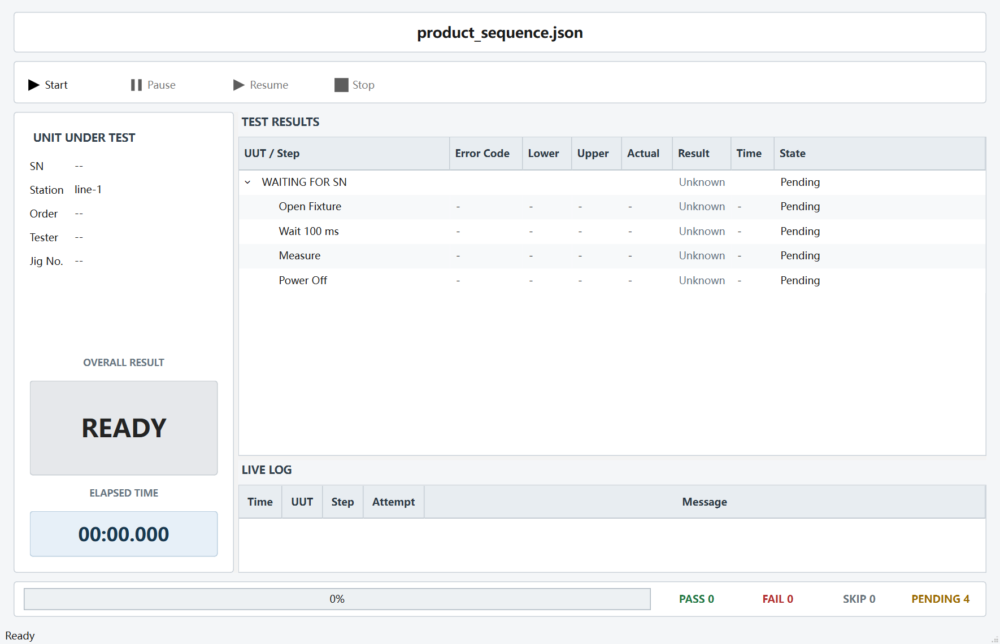
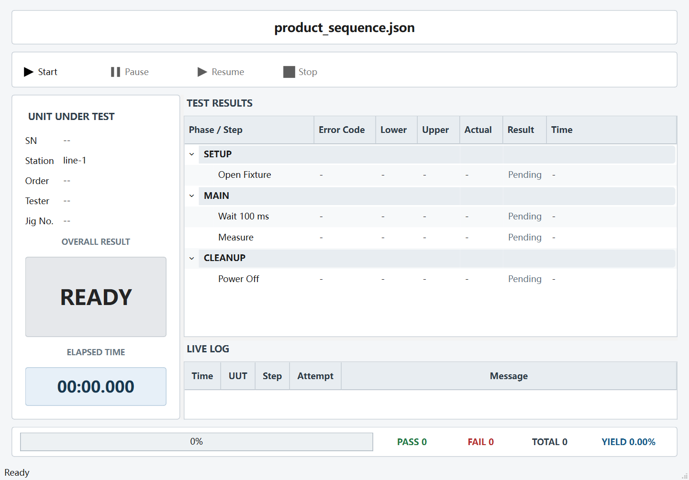
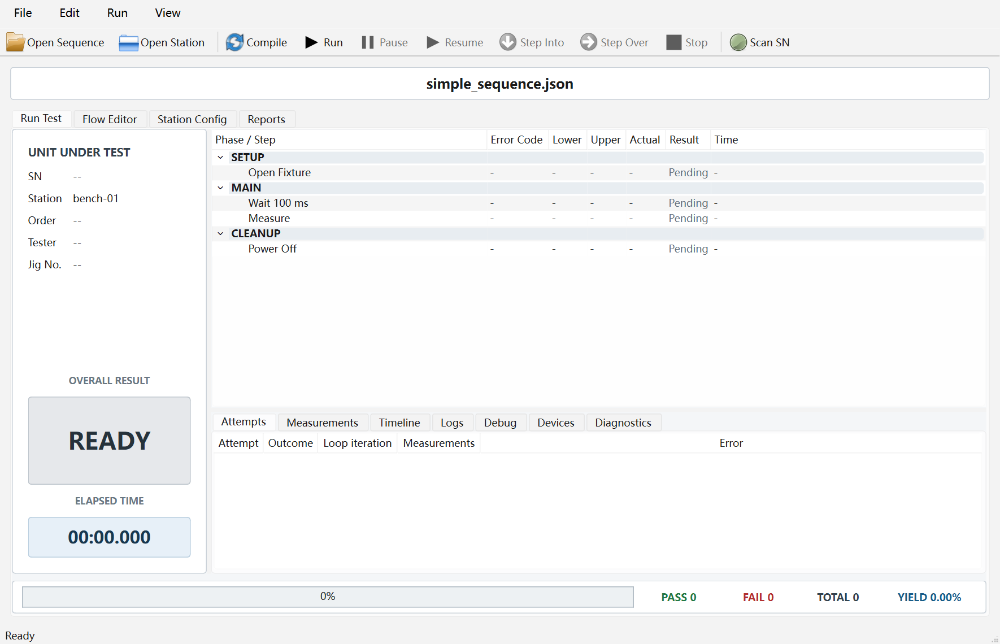

# PicoATE 双模式 UI 设计

## 1. 目标

PicoATE 使用同一个 `PicoATE.UI.exe`，启动后先进入登录界面，由用户选择运行模式和测试脚本。

- `TEST`：面向产线操作员，只保留扫码、运行控制、测试结果和实时日志。
- `Admin`：面向工程师，开放流程编辑、Station 编辑、编译、断点、单步、报告和调试信息。
- 两种模式共用同一套 `ExecutionViewModel`、调度引擎、RuntimeEvent 和 ExecutionReport，不复制任务引擎。

## 2. 启动规则

1. 登录页模式下拉框默认选择 `TEST`。
2. 程序扫描可执行程序根目录下的 `*.json`。
3. 文件名必须包含 `seq`（自然包含 `sequence`），并且 JSON 根对象必须包含 `groups` 数组，才进入脚本下拉框。
4. 不提供浏览按钮，避免产线选择根目录之外的临时脚本。
5. 登录页不显示也不选择 Station，后台固定读取测试脚本同目录下的 `StationSystem.json`。
6. TEST 登录前必须完成 Sequence 编译和 Station 校验；失败时不允许进入运行页。
7. Admin 允许打开编译失败的 Sequence，以便工程师进入编辑器修复，但 Station 文件必须存在且可解析。

开发构建如果输出目录没有 Sequence，会回退扫描源码工程的 `examples` 目录；发布版本仍以可执行程序目录为根目录。

## 3. Admin 日期密码

Admin 登录使用当天动态口令：

```text
密码 = 33 + (月份十位 + 月份个位) * (日期十位 + 日期个位)
```

例如 07 月 10 日：

```text
33 + (0 + 7) * (1 + 0) = 40
```

密码在每次校验时根据本机当天日期计算，不保存明文。它用于防止产线人员误操作，不作为高安全等级身份认证。

## 4. Station 扫码开关

`StationSystem.json` 根节点新增：

```json
{
  "scanDialogEnabled": true
}
```

- 缺省值为 `true`。
- Admin 的 Station 属性页提供 `Enable Scan Dialog` 复选框。
- `true`：TEST 模式编译就绪后弹出扫码窗口，扫码成功自动运行。
- `false`：不显示扫码窗口，操作员使用 TEST 工具栏的 Start 按钮运行。
- CLI 和调度引擎忽略这个 UI 配置，不改变执行语义。

## 5. 扫码窗口

- 使用非阻塞、非模态且置顶的 `QDialog`，不调用反复嵌套的 `exec()`；TEST 主窗口仍可移动、最小化、最大化和正常关闭。
- 扫码框保留原生可拖动标题栏，但不提供关闭、最小化、最大化按钮，Esc、Alt+F4 和普通 Close 对扫码框无效。
- 显示后清空旧输入并自动聚焦 SN 输入框。
- 扫码器以 Enter 结束；第一版校验规则为去除首尾空格后非空。
- 非法扫码不关闭窗口，也不清空上一台测试结果。
- 合法扫码后隐藏窗口，把 SN 作为本次 UUT ID 和 `${uut.sn}` 运行变量传入 Session。
- 扫码框不提供 Administrator Unlock；需要停用扫码时，应在登录页进入 Admin，修改并保存 `StationSystem.json` 的扫码开关，再重新进入 TEST。

## 6. TEST 结果展示

编译成功后立即展示完整的已启用执行流程，不等某一步开始后才插入。

- TestItem、TestItem 子 Step、独立 Step、Setup 和 Cleanup 全部显示。
- TestItem 使用父子树结构，子 Step 默认展开。
- disabled Step 不进入 ExecutionPlan，因此 TEST 页面不显示。
- Loop body 只显示一套结构，迭代次数和 Attempt 在状态中更新，不重复插入多套行。
- Retry 更新同一个 Step 的 Attempt 数，不创建重复测试项。

当前 TEST 页面只面向单个 UUT，结果树不再增加 `WAITING FOR SN` 或 UUT 根节点，
而是直接按执行阶段展示：

```text
SETUP
  Open Fixture
MAIN
  TestItem / 独立 Step
  子 Step
CLEANUP
  Close Fixture
```

- `Setup` 组显示在 `SETUP`；
- `Main` 和 `Custom` 组统一显示在 `MAIN`；
- `Cleanup` 组显示在 `CLEANUP`；
- 阶段来自编译后的 `ExecutionPlan`，经实时事件和最终报告传给 UI，不依赖 Step 名称猜测；
- 空阶段不显示，存在的阶段按 Setup、Main、Cleanup 固定顺序排列；
- SN 仍显示在左侧产品信息区，未扫码时显示 `--`，扫码后显示本轮产品 SN。

颜色约定：

| 状态 | 颜色 |
|------|------|
| Pending | 白色或浅灰色 |
| Running / Paused / Stopping | 黄色 |
| Passed | 绿色 |
| Failed / Error / Timeout | 红色 |
| Skipped / Cancelled | 灰色 |

失败停止时：

1. 失败 Step 进入红色 Failed/Error/Timeout 终态。
2. 后续已不可能执行的主流程 Step 进入灰色 Skipped 终态，不保留 Pending。
3. Cleanup 继续运行，并按 Running/Passed/Failed 显示真实状态。
4. Session 最终结束后，结果页不允许残留 Running 状态。

失败继续时：

1. 普通 Step 的 Failed/Error/Timeout 保持红色，但继续后续流程。
2. TestItem 内的后续子 Step 也继续执行，不再因首个失败统一变成 Skipped。
3. 父 TestItem 汇总真实最严重结果，后续外层测试项继续。
4. 用户 Stop/Abort 仍立即停止；测试结束后的 PASS/FAIL 与良率使用最终报告真实结果。

## 7. 连续测试状态

```text
编译并显示完整 Pending 流程
    -> 等待扫码
    -> 合法 SN
    -> 清空上一轮日志和状态
    -> 自动运行
    -> Cleanup
    -> 最终报告
    -> 保留 PASS/FAIL、步骤状态、日志和耗时
    -> 再次显示扫码窗口
    -> 下一次合法 SN 后才清空并开始新一轮
```

如果 `scanDialogEnabled=false`，Start 按钮承担“下一次合法扫码”的触发职责。

## 8. 当前实现状态

已完成第一版：

- 日期 Admin 密码；
- Sequence 根目录自动发现和结构识别；
- 固定 `StationSystem.json` 路径；
- Station 扫码开关和 Admin 编辑；
- LoginDialog 模式、脚本和密码校验；
- TEST 专用 ProductionWindow；
- 无普通关闭能力的 ScanDialog；
- SN 显式传入 UUT 和运行变量；
- 编译后完整流程预览；
- TEST 结果树、实时日志、进度和耗时；
- TEST 主表字段：ErrorCode、Lower、Upper、Actual、Result、Time；
- Step 总耗时和 Attempt 单次耗时进入实时事件、最终报告、历史 JSON 与 CSV；
- Running 黄色、Passed 绿色、Failed 红色、Skipped 灰色；
- 失败停止、后续 Skipped、Cleanup 继续执行的窗口级测试。
- TEST 页面已按产线工作流重排：顶部脚本和控制栏、左侧 UUT 信息/总结果/耗时、右侧结果树和实时日志、底部步骤进度及产品良率统计。
- 右下角 PASS/FAIL/TOTAL/YIELD 按整台产品统计，每份最终报告最多累计一次；Step 和 TestItem 的通过/失败数量不进入良率。
- 正常完成且无错误记 PASS，完成但有错误记 FAIL，Abort 或未完成不进入 TOTAL；YIELD = PASS / TOTAL x 100%。
- 当前版本按 TEST 窗口生命周期累计，重启应用后从 0 开始；班次持久化和清零按钮留作后续配置项。
- `StationSystem.json` 的 `stationId` 和 `metadata.order/tester/jigNo` 可直接显示在左侧信息区，缺失值显示 `--`。
- 相同 SN 可以跨测试轮次重复使用，UI 不执行历史去重。
- 已使用真实 Qt 窗口抓图检查 1180x760 基准布局，并增加成功、失败和 Skipped 数量的窗口测试。
- 单 UUT 结果树已去除 `WAITING FOR SN` 层，改为 `SETUP / MAIN / CLEANUP` 三段流程；阶段信息贯穿 Plan、RuntimeEvent 和 ExecutionReport。
- Admin 登录后默认进入与 TEST 相同信息层级的单 UUT `Run Test` 首页，顶部额外开放 Compile、Pause/Resume、Step Into/Over、Stop 和 Scan SN。
- 当前 Sequence 文件名固定显示在 Admin 工作区最上方、一级分页栏之前；切换编辑、工站或报告分页时仍保持可见。
- Admin 的 `Flow Editor / Station Config / Reports` 作为一级分页保留，运行首页下方继续提供 Attempts、Measurements、Timeline、Logs、Debug、Devices 和 Diagnostics 工程信息。
- Admin 扫码框永不自动弹出，也不受 `scanDialogEnabled` 控制；只有工程师点击 `Scan SN` 后显示，合法 SN 触发一次单 UUT 运行。

当前 TEST 基准布局：



当前阶段分区布局：



Admin 默认运行首页：



后续工作：

- 扫码长度和正则表达式配置；
- 插件 Manifest、左侧功能库、拖拽编排和动态参数编辑器；
- 登录页视觉打磨、键盘焦点与真实扫码器长时间验证。
- 多 UUT TEST 页面暂不开发；未来需要时以最多四个独立 UUT 面板做 2×2 布局，每个面板各自展示阶段、结果和进度，不改动当前单 UUT 调度语义。

## 9. 视觉效果图评审记录（2026-07-18）

本轮高保真效果图只用于提取局部设计方向，不作为整页照搬的实现稿。

确认保留的方向：

- TEST 效果图中实时日志表的 `Level` 表达较清楚，可作为日志等级列的视觉参考：使用简洁的等级文字和小型状态色标，不用大面积底色。
- Admin 效果图左侧功能库的组织方式较好，可继续采用“搜索 + 基础功能 + 插件分类 + 可拖动功能行”的结构。
- Admin 底部诊断区的 `Type` 列层级清楚，可作为 Diagnostics、编译校验和 Station 校验列表的样式参考。

需要调整的方向：

- 两张效果图整体仍偏花哨，下一轮应进一步减少边框、图标数量、彩色装饰和多余状态标记。
- 不照搬 TEST 效果图的整体布局与大面积 PASS 卡片，只吸收日志等级列的处理方式。
- Admin 左侧功能库保留信息架构，但视觉上要更安静、更紧凑，避免每个功能都像独立卡片或按钮。
- 诊断区只借鉴 `Type` 列的信息表达，不要求复制整套底部面板外观。

下一轮视觉原则：

1. 以当前可用 Qt 界面为基础做减法，不进行整页推翻式重做。
2. 优先统一日志等级、诊断类型、选择高亮、行高、字体和分隔线。
3. 苹果风格只体现在秩序、留白、字体、图标和交互细节，不引入玻璃化、悬浮卡片或过多动画。
4. TEST 保持产线信息一眼可读；Admin 保持高信息密度和工程操作效率。

## 10. Flow Editor 目标设备选择（2026-07-18）

Flow Editor 将“插件提供什么功能”和“当前 Step 操作哪台设备”分开：

- Station Config 是可用设备、通道和驱动绑定的唯一来源；Flow Editor 不写死 CX、GCAN 等厂家与 CAN1/CAN2 的对应关系。
- 左侧顶部显示目标设备快捷区。CAN 的物理设备按 `CAN1`、`CAN2` 展示，通道在选中设备后单独选择；`CAN1.CH1/CAN1.CH2` 不再各占一张设备卡片。
- 插件功能只显示一套通用名称，例如 Open、Send、Read、Close，不再生成 `Open [CAN1.CH1]`、`Open [CAN1.CH2]` 等重复条目。
- 选择 `CAN2 + CH2` 后拖入功能，生成 Step 时自动写入 `inputs.deviceId = CAN2.CH2`；运行时继续由 Station 把该 Logical ID 解析到实际 `driverId` 和 DLL。
- 切换目标设备后，功能列表读取该设备绑定插件的 Describe；相同功能保持统一名称，厂家特有功能只在选中对应设备时出现。
- 基础功能 Wait、Limit、Test Item、Loop 等不依赖目标设备，始终可用。

设备数量规则：

1. 设备不超过四台时全部显示为快捷设备。
2. 超过四台时显示当前设备和最近使用设备，并提供“更多设备”入口。
3. “更多设备”按设备类型分组并支持搜索；选择后该设备进入快捷区。
4. 未配置驱动或插件描述不可用的设备灰显，不能生成插件 Step。
5. 当前目标始终显示完整 Logical ID，例如 `CAN2.CH2`、`DMM1`。

当前实现已经覆盖设备/通道切换、超过四台设备、无驱动设备、插件随目标切换、拖放自动绑定和回归测试。该功能只调整 Admin UI 与编辑模型，不改变调度引擎。

## 11. Flow Editor 参数编辑（2026-07-18）

右侧属性区采用“优先选择、其次填空、最后高级 JSON”的顺序：

1. 插件 Step 先通过 `Target device` 选择 Station 中兼容的逻辑设备或通道。
2. 枚举参数使用下拉框，布尔参数使用 ON/OFF，普通数值、字符串和十六进制帧使用填空。
3. Wait、Limit 等基础功能继续使用专用控件，不要求工程师理解 JSON 字段。
4. `Inputs` 和 `Parameters` 原始 JSON 收进默认折叠的 `Advanced JSON`。
5. 旧脚本中的未知字段不会被删除；折叠标题会提示额外字段数量，便于工程师发现兼容数据。
6. 完全类型化且没有额外字段的基础功能不显示 Advanced JSON。

`parameters` 没有从 Sequence 格式中删除。它仍是底层 Step Handler 的扩展载荷，也是旧脚本的兼容边界；
只是从日常 UI 中退到高级入口，避免工程师面对两套看起来重复的参数来源。
